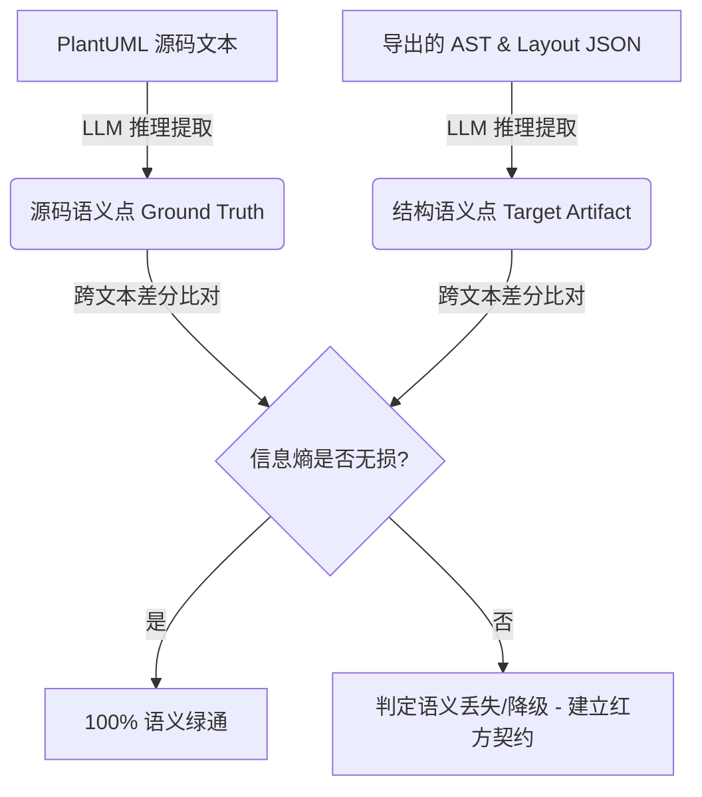

# 智能体语义回溯审计流程规范 (Semantic Round-trip Verification Workflow)

在复杂语法解析与多维数据渲染管线中，传统的单元测试和“以代码校验代码”的脚本比对往往存在**逻辑盲区**。为了确保源码语义无损地流转到 AST 与物理布局图元中，本项目定义并推行**“智能体语义回溯审计流程”**。

本规范详述了该流程的核心思想、执行步骤、盲区剖析以及以“类成员 Note 绑定丢失”为典型案例的实战分析。

---

## 一、 为什么传统的代码验证会失效？

在软件工程中，开发人员常习惯于编写比对脚本（如使用 Python 正则表达式或解析库）来自动化核对输出。但这种方法在语义级的编译器校验中存在两个致命的**假阴性（False Positive）**盲区：

1. **自己出卷自己答（对齐现状而非真理）**：
   比对脚本通常是基于当前解析器的输出来设计的。如果解析器本身设计不完整（例如丢失了某个修饰属性），编写脚本时往往会默认忽略这一属性的断言，从而使漏网之鱼在脚本测试中“全绿通过”。
2. **正则表达式的局限性**：
   使用复杂的正则去剥离和匹配源码极其脆弱，极易因为符号混淆（如在中括号外部的冒号与内部限定词冒号）导致错误的解析，为了修复脚本自身的 Bug，开发人员往往会进行“妥协式去噪”，进一步放过了微小的语义丢失。

> [!IMPORTANT]
> **核心原则**：LLM 绝不能仅仅依赖自编的比对脚本来断言数据正确性。必须将大模型的“跨文本纯语义推理能力”作为独立的红方审计员，直观对齐源码与输出数据。

---

## 二、 语义回溯审计核心思想

**语义回溯审计 (Semantic Round-trip Verification)** 是一种基于 LLM 纯推理的非代码比对技术。其基本链路如下：



通过直接将**源码文本**与**结构化数据文本**并置在 LLM 的上下文中，大模型凭借强大的上下文对准与语义分析能力，检索源码中的每一个标识符、操作符、修饰符在 JSON 中是否具备**等价且无损的载体**。

---

## 三、 审计流程四步法

### 第一步：提取真理源 (Ground-Truth Extraction)
列出源码中所有包含高级语法特性的声明行。特别标记出：
* 特殊元类型（如 `json`, `circle`, `diamond`）；
* 细粒度修饰词（如渐变色样式、边框粗细样式）；
* 连线端点修饰（如限定关联词 `[...]`、多重度、成员级 `::` 指定）；
* 备注绑定端点（如 `note left of Class::member`）。

### 第二步：提取目标语义 (Target Semantic Retrieval)
直接查阅编译运行后输出的 `test_ast.json` 或 `test_layout.json` 中的相关结构片段。

### 第三步：信息熵差分审计 (Entropy Gap Analysis)
LLM 执行纯推理比对，回答以下问题：
1. 源码行中的每一个显式属性，是否能在 JSON 的字段中找到 1:1 的无损映射？
2. 字段值是否被粗暴削减（如把 `Class::member` 削减为 `Class`）？
3. 是否存在因 swap 翻转导致的数据错位？

### 第四步：物理拓扑与约束保真度审计 (Physical Constraint & Topology Fidelity Audit)
红方审计员应重点审查**物理排版对齐与约束是否在翻译为布局 DOT 语法时发生流失**。重点核对：
1. **端点端口对准 (Port Alignment)**：对于成员级连线（如 `A::memberA -> B::memberB`）或成员级 Note 绑定，须检查导出的布局 JSON/DOT 是否将连线端点绑定到特定的单元格端口（如 `"A":"member_0"`），避免端点退化为整个类节点，造成物理指向错误。
2. **布局约束拉力 (Layout Constraints)**：检查强关联节点（如 Note 框与其宿主类、关联类与其连线物理中点）之间的连线是否被错误地赋予了 `constraint = false`。一旦发现因忽略约束导致元素在物理排版中“随机漂移/离宿主极远”，必须判定为排版失真，建立红方阻断。

### 第五步：红方契约建立与重构绿通 (Red-Side Contract & Safe Refactoring)
1. **定义目标契约**：如果发现信息或排版丢失，首先在 AST 和 Layout 数据模型中定义好期望的承载字段（如 `toPort`, `constraint`）。
2. **红方报错**：要求校验流程在没有该字段或该字段不符预期时直接报错，形成红方关卡。
3. **代码重构**：修改解析器和布局引擎的 C++ 代码，填充该字段并纠正布局。
4. **重新验证**：确保红方关卡绿通，语义与物理拓扑双重 100% 无损。

---

## 四、 案例剖析：类成员 Note 绑定丢失 Bug

在最近的一次迭代中，本流程成功拦截并定位了一个隐藏极深的语义流失 Bug：

### 1. 源码基准
```plantuml
class MemberNoteTarget {
  {static} int counter
}
note left of MemberNoteTarget::counter
该成员已注释
end note
```

### 2. AST JSON 原始输出
```json
[
  {
    "boundToId": "MemberNoteTarget",
    "id": "",
    "text": "该成员已注释"
  }
]
```

### 3. LLM 差分推理过程
* **源码分析**：Note 显式绑定到了 `MemberNoteTarget` 的 `counter` 成员上，信息熵包含两个维度：`[类 ID: MemberNoteTarget]` 和 `[成员 ID: counter]`。
* **JSON 分析**：AST 中只有 `"boundToId": "MemberNoteTarget"`，**完全丢失了成员信息 `counter`**。
* **结论**：发生了信息降级（将成员 Note 降级为了普通类 Note），多行和单行 Note 解析时丢弃了 `targetMember`。

### 4. 修复与验证方案
基于此流程，我们将在 [DiagramAst.h](file:///F:/B_My_Document/GitHub/plantuml-qt/src/ast/DiagramAst.h) 的 `NoteDecl` 中定义 `QString boundToMember;` 字段，重构 [PumlParser.cpp](file:///F:/B_My_Document/GitHub/plantuml-qt/src/parser/PumlParser.cpp) 的 `NoteCommand`，并要求 AST 和 Layout 必须完全对准这一属性，以实现成员 Note 绑定的高保真对齐。

---

> [!TIP]
> 坚持推行**“智能体纯推理差分审计”**是保障高精度解析和零信息丢失的唯一有效途径。在今后的所有重构和校验环节中，均应遵循此四步法。
